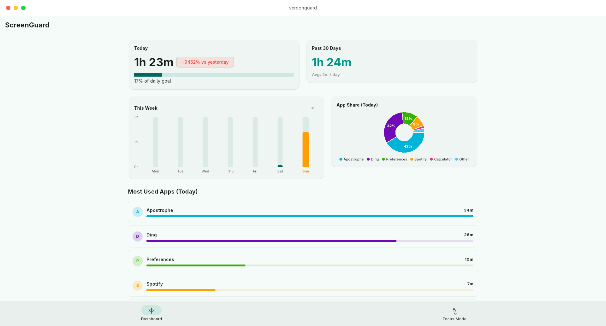
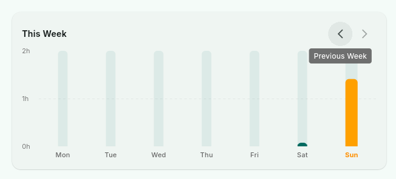
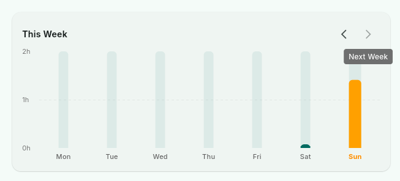
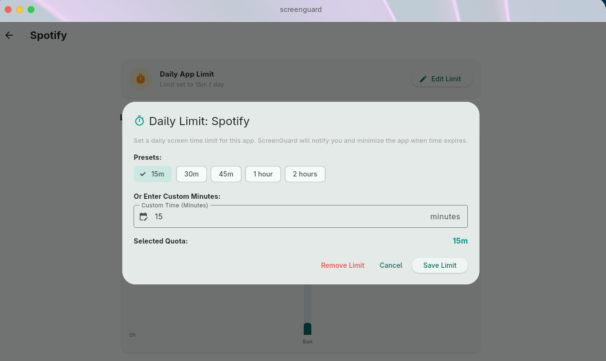
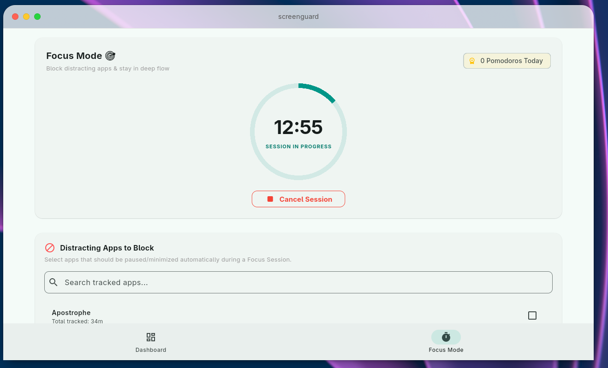
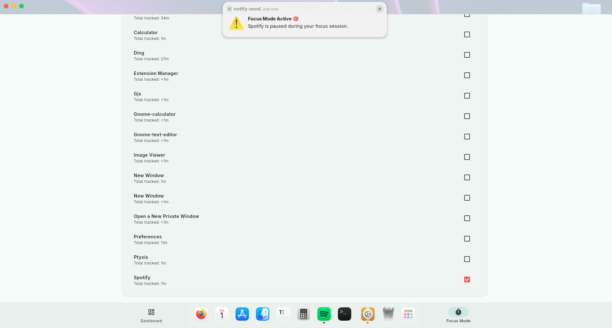
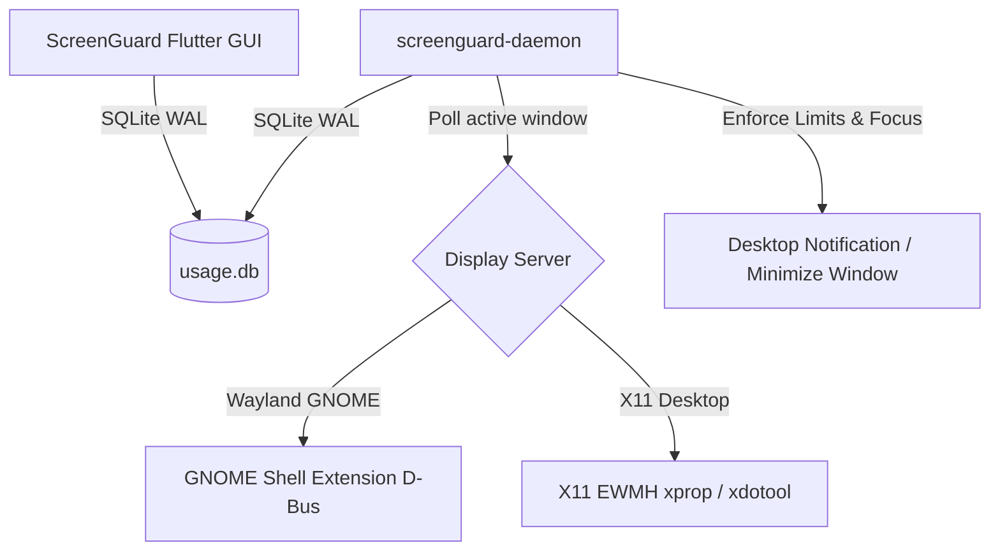

# ScreenGuard — Digital Wellbeing for Linux 🛡️
> Modern Screen Time Tracking, Daily App Limits & Focus Mode for Wayland & X11.


**ScreenGuard** is an open-source, privacy-first desktop application built in Flutter for Linux. It brings active **Android-style Digital Wellbeing**, **Daily App Limit Lockouts**, and **Focus Mode Pomodoro Session Blocking** directly to the Linux desktop.

> ℹ️ **Desktop Environment & Display Server Support**
> * **X11 Desktops**: Fully supported out-of-the-box across **ALL X11 desktop environments** (GNOME X11, KDE X11, XFCE, MATE, Cinnamon, LXQt, i3, Openbox, etc.).
> * **Wayland Desktops**: Currently supported natively on **GNOME Wayland** (Fedora, Ubuntu, Debian, Arch GNOME) via the native ScreenGuard GNOME Shell Extension. *(Support for KDE Plasma Wayland and Hyprland/Sway is planned for upcoming releases).*
>
> 📌 **Important for X11 Testing**: X11 window tracking and active window minimization are currently in **active community testing**. When filing an issue or bug report regarding X11, please attach **screenshot or video proof** along with your Desktop Environment name & version so the issue can be reproduced and resolved quickly.

---

## 🚀 Key Features

### 1. 📊 Digital Wellbeing Dashboard
* **Hero Overview Cards**: Instantly view Today's active screen time alongside past **30-Day cumulative totals** and daily averages.
* **Interactive Weekly Bar Chart**: Visualizes screen time for each day of the week with human-friendly tooltips (`45m`, `1h 27m`).
* **App Share Donut Chart**: Proportional breakdown of app usage with color-coded legends.
* **Per-Day App Breakdown**: Shows every tracked application ordered by usage time with custom progress bars.



---

### 2. 🗓️ Week-by-Week Navigation & History Slider
* **Multi-Week History**: Slide back week by week (`<` / `>`) to view previous weeks.
* **Interactive Day Inspector**: Tap any bar in the chart to load that specific day's app breakdown (e.g. `Most Used Apps (Wednesday, Aug 12)`).




---

### 3. ⏱️ Daily App Time Limits & Lockout Screen
* **Custom & Preset Quotas**: Set daily limits per application using preset buttons (30m, 1h, 2h, 4h) or enter custom minute values.
* **90% Warning Threshold**: Desktop notification alerts you when you reach 90% of your allotted app limit.
* **100% Time's Up Lockout Screen**: When the daily limit is reached, ScreenGuard minimizes the active window and triggers a dedicated lockout overlay screen with options:
  * ⏱️ **Add 15 Minutes** (Temporary extension)
  * ⚙️ **Edit Limit**
  * 🏠 **Back to Dashboard**



---

### 4. 🎯 Focus Mode (Pomodoro Timer & Distraction Blocker)
* **Animated Pomodoro Timer**: Preset sessions (`15m`, `25m`, `45m`, `60m`) with live circular countdown ring.
* **Distraction Blocker**: Select distracting apps from a searchable checklist. During an active focus session, ScreenGuard automatically minimizes blocked apps if opened.
* **Focus Statistics**: Tracks completed focus sessions per day.




---

### 5. 🔒 100% Private & Local Storage
* Session logs are stored locally in SQLite (`~/.local/share/screenguard/usage.db`) in WAL journal mode.
* No data ever leaves your computer. No cloud accounts, telemetry, or third-party tracking.

---

## 🏗️ Architecture



* **GUI App**: Built using Flutter & Material 3.
* **Daemon (`screenguard-daemon`)**: Lightweight background service compiling to a single native binary.
* **Extension (`screenguard@screenguard.app`)**: Native GNOME Shell Extension exporting active window title/class over D-Bus (`org.gnome.Shell.Extensions.ScreenGuard`).
* **X11 Backend**: Standard EWMH `_NET_ACTIVE_WINDOW` query via `xprop` and window minimization via `xdotool`.

---

## 📦 Installation

Choose your Linux distribution below. Simply copy and paste the commands into your terminal.

### 🐧 Ubuntu / Debian / Zorin OS / Linux Mint / Pop!_OS

**Option A — APT repository (recommended, receives updates):**
```bash
sudo wget -O /usr/share/keyrings/screenguard.asc https://adityakrishnan005-a11y.github.io/ScreenGuard/apt/key.asc
echo "deb [signed-by=/usr/share/keyrings/screenguard.asc] https://adityakrishnan005-a11y.github.io/ScreenGuard/apt apt main" | sudo tee /etc/apt/sources.list.d/screenguard.list
sudo apt update && sudo apt install screenguard
```

**Option B — standalone `.deb`:**
```bash
wget https://github.com/adityakrishnan005-a11y/ScreenGuard/releases/download/v0.1.0/screenguard_0.1.0_amd64.deb && sudo apt install ./screenguard_0.1.0_amd64.deb -y
```

### 🎩 Fedora / RHEL / Rocky Linux (Copr)
```bash
sudo dnf copr enable the-amibivert/screenguard
sudo dnf install screenguard
```

### 🏹 Arch Linux / Manjaro (custom repository)

> The AUR package is coming soon (AUR account registration is temporarily suspended). Until then, use our signed custom repository:

```bash
# 1. Import & locally trust the signing key
curl -fsSL https://adityakrishnan005-a11y.github.io/ScreenGuard/arch/key.asc -o /tmp/screenguard.asc
sudo pacman-key --add /tmp/screenguard.asc
sudo pacman-key --lsign-key 5E851C89E39A8FD573BF40EAEC671823CA28A37E

# 2. Append the repository to /etc/pacman.conf:
#    [screenguard]
#    Server = https://adityakrishnan005-a11y.github.io/ScreenGuard/arch/$arch
#    SigLevel = Required DatabaseRequired TrustedOnly

# 3. Install
sudo pacman -Sy && sudo pacman -S screenguard
```

---

## 🚀 Getting Started

1. **Launch ScreenGuard** from your applications menu (or run `screenguard` in a terminal).
2. **Start the tracking daemon** (runs in the background and auto-starts on login):
   ```bash
   systemctl --user enable --now screenguard
   systemctl --user status screenguard   # verify it is active
   ```
3. **GNOME Wayland — enable the Shell extension** so ScreenGuard can read the active window:
   ```bash
   gnome-extensions enable screenguard@screenguard.app
   ```
   - On **Debian/Ubuntu/Fedora** the package post-install step enables AT-SPI accessibility and copies the extension for you.
   - On **Arch**, run `sudo /usr/share/screenguard/enable_fedora_a11y.sh` once, then enable the extension.
4. Open the dashboard to set **daily app limits** and start a **Focus Mode** session.

> 💡 **X11 sessions (KDE X11, XFCE, etc.)**: tracking works out-of-the-box via `xprop`/`xdotool` (install `xdotool`, `xorg-xprop`, and optionally `xprintidle` for idle detection). Native Wayland on non-GNOME compositors is not yet supported — use an X11 session there.

### 🔒 Data & Privacy

* All session data is stored **locally** in a SQLite database at `~/.local/share/screenguard/usage.db` (WAL mode).
* No cloud sync, no accounts, no telemetry. Your screen-time data never leaves your machine.

---

## 🛠️ Building from Source (Developers)

If you prefer to clone the repository and build the binaries yourself:

```bash
# 1. Clone the repository
git clone https://github.com/adityakrishnan005-a11y/ScreenGuard.git
cd ScreenGuard

# 2. Install dependencies & build release bundle
flutter pub get
flutter build linux --release

# 3. Compile the background tracking daemon
dart compile exe bin/daemon.dart -o build/linux/x64/release/bundle/screenguard-daemon

# 4. (Optional) Create .deb and .rpm packages
nfpm package -f packaging/nfpm.deb.yaml -t dist/screenguard_0.1.0_amd64.deb
nfpm package -f packaging/nfpm.rpm.yaml -t dist/screenguard-0.1.0-1.x86_64.rpm
```

---

## 🗺️ Roadmap & Future Enhancements

We are actively working on expanding ScreenGuard! Here is what is currently planned for upcoming releases:

- 🌐 **Browser Extension (Web Tracking)**: Track active browser tabs (YouTube, Reddit, Docs) separately instead of grouping all browsing under one browser app.
- 📁 **Categorized App Group Limits**: Group multiple apps under a shared limit (e.g. limit all "Social Media" apps to 1h/day combined).
- 🖥️ **KDE Plasma & Hyprland / Sway Support**: Native Wayland protocols (`wlr-foreign-toplevel-management`) for non-GNOME Wayland compositors.
- 📊 **Data Export**: Export your historical screen time data to CSV or JSON formats for custom analysis.
- 📈 **Weekly Digest Reports**: Generate automated PDF or Markdown summaries of weekly productivity trends.
- ⚙️ **Strict Mode**: Optional hard lockouts that prevent adding extra extension time once a daily limit is reached.

---

## ❓ FAQ

**Tracking shows "unknown" on GNOME / Wayland?**
Ensure the ScreenGuard GNOME Shell extension is enabled (`gnome-extensions enable screenguard@screenguard.app`) and toolkit-accessibility is on. For sandboxed **Flatpak** apps, AT-SPI access must be granted — the Debian/Ubuntu/Fedora post-install script does this automatically, but if you installed via a method that skips post-install (e.g. Arch) or use user Flatpaks, re-run `sudo /usr/share/screenguard/enable_fedora_a11y.sh`.

**Nothing is tracked on KDE Plasma Wayland / Sway / Hyprland?**
Native Wayland tracking is currently only available on **GNOME Wayland**. For KDE and other compositors, log into an **X11 session** (e.g. Plasma X11), where ScreenGuard tracks via `xprop`/`xdotool`.

**The daemon isn't running.**
Check `systemctl --user status screenguard`. If inactive, run `systemctl --user enable --now screenguard`. Note it requires an active graphical session (`graphical-session.target`), so it only starts once you're logged in.

**How do I reset or move my data?**
Stop the daemon (`systemctl --user stop screenguard`), then delete `~/.local/share/screenguard/usage.db*` and relaunch to start fresh.

**How do I update ScreenGuard?**
Use your package manager — APT, DNF (Copr), and the Arch repo all deliver updates. Or download the latest release asset from the [releases page](https://github.com/adityakrishnan005-a11y/ScreenGuard/releases).

**Where do I report bugs?**
Open a [GitHub Issue](https://github.com/adityakrishnan005-a11y/ScreenGuard/issues). For **X11** problems, please attach a screenshot/video and your desktop environment + version so we can reproduce it.

---

## 🤝 Contributing

Contributions are warmly welcomed! ScreenGuard is built by and for the Linux community.

Whether you want to:
* 🐛 **Report a bug** or suggest a feature via GitHub Issues *(for X11 issue reports, please attach screenshot or video proof along with your DE name and version)*.
* 📦 **Help package ScreenGuard** for Flathub (Flatpak), Snapcraft, or Gentoo.
* 🌐 **Translate ScreenGuard** into new languages.
* 💻 **Submit Code / PRs**: Check out open issues and submit a Pull Request!

### How to Contribute
1. Fork the repository.
2. Create a new feature branch (`git checkout -b feature/amazing-feature`).
3. Commit your changes (`git commit -m 'Add amazing feature'`).
4. Push to the branch (`git push origin feature/amazing-feature`).
5. Open a Pull Request!

---

## 📄 License & Author

**ScreenGuard** is created and maintained by **Aditya Krishnan** ([aditya.krishnan005@gmail.com](mailto:aditya.krishnan005@gmail.com)).

Distributed under the [GNU General Public License v3.0 (GPLv3)](LICENSE).
